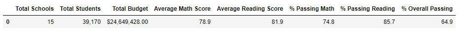
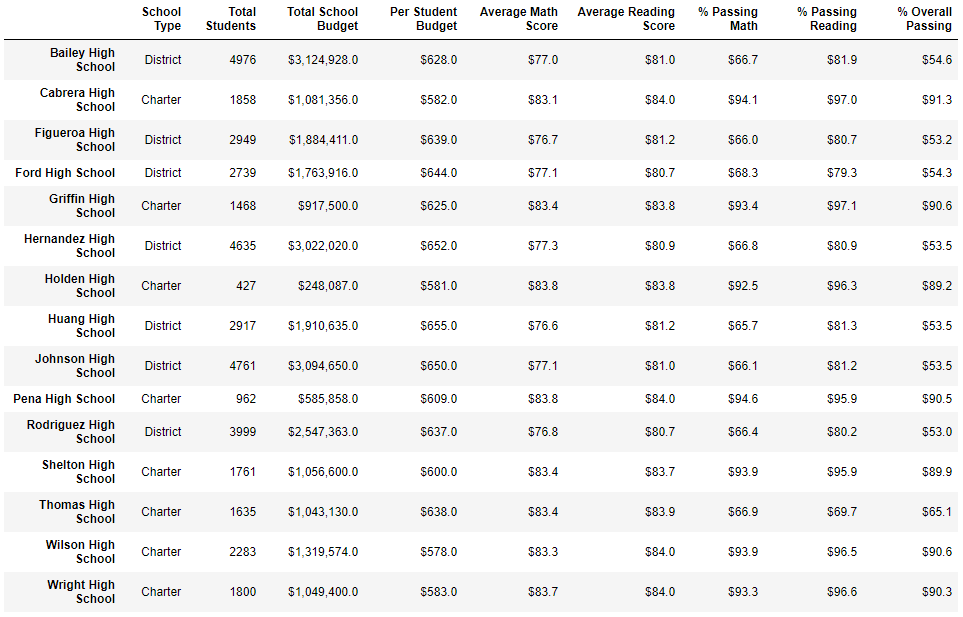
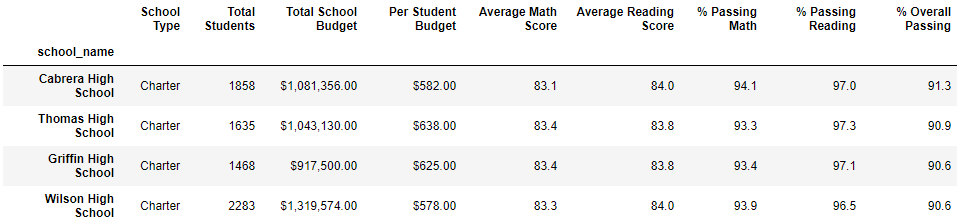
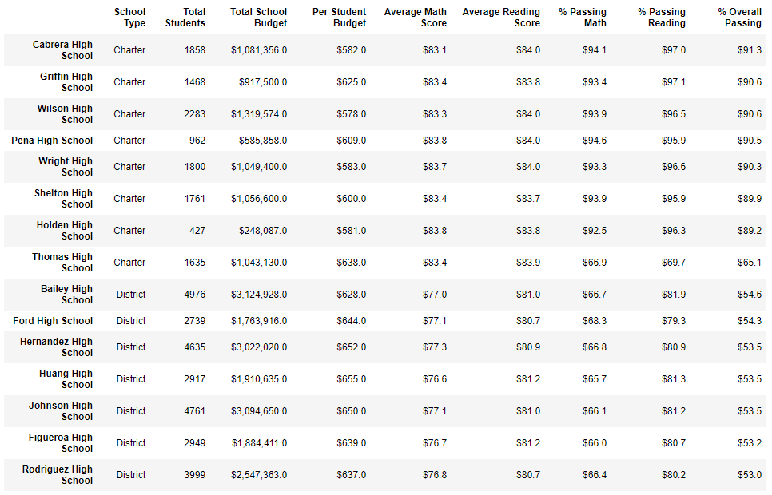
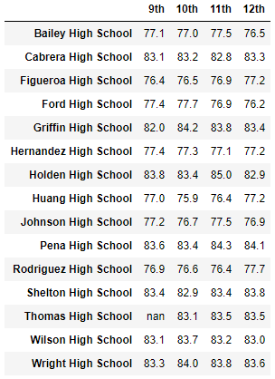
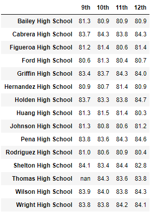
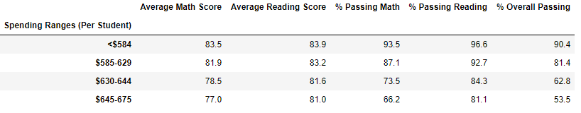
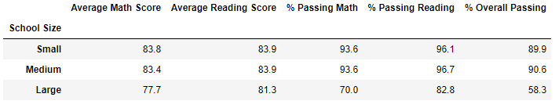
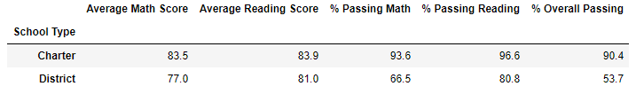

## Contents
- [Overview of the Project](#overview)
- [Files](#files)
- [Results](#data-analysis-results)
- [Impacts](#other-impacts)

## Overview
The purpose of the analysis is to help a school district understand performance trends using standardized testing scores from several schools. Reading and math scores are available for schools in the district. The analysis involves slicing the data many ways and reporting performance of the schools in both subjects. An important part of the analysis is to discard data where the scores are suspect. Python (and Pandas) with Jupyter Notebook was used to complete the analysis.

## Files
- PyCitySchools_Challenge.ipynb - Contains code and all the required output dataframes

## Data Analysis Results

### District Summary
The key difference from previous analysis is the elimination of 9th grade reading and math scores for Thomas High School. These students constitute a very small percentage of the total number of students on the district. The overall passing percentages decrease slightly with the elimination of ninth grade results as shown below:

### School Summary
The results for Thomas High School however are affected more drastically with the elimination of 9th grade results. The previous results were artificially inflated due to the suspected academic dishonesty. The overall passing percentage decreased from previous values of 90% to ~65% as shown below:

### School Level Performance 
Thomas High School's performance relative to the other schools was significantly affected with the elimination of 9th grade scores. The scores were eliminated, but the total number of students used in the calculation of percentages stayed the same. This put Thomas High Schools in the middle of the pack, while it previously was in the top 3 schools:

### Other Impacts

#### Grade Level Impact

Eliminating the 9th grade scores of Thomas High School resulted  in slightly lower overall average scores. The reading average decreased from 82.5 to 82.4, while the math avearge decreased from 80.4 to 80.1, both insignificant changes. Shown below are the scores by school and grade:

#### Spending Level Impact 
Minimal to no impact was observed when viewing scores by spending levels. Thomas High Schools falls in the $630-644 spending range. The passing percentage decreased by 0.1%  in each of the categories due to the 9th grade score replacement.

#### School Size Impact
Thomas High School falls in the Medium sized schools category. Again, minimal impact of <0.5% was observed in this category.

#### School Type Impact
Thomas High is a charter school. Impact of <0.1% was observed in this category.

### Summary of Changes
Following is a summary of changes with the elimination of Thomas High School 9th grade scores: 
1. Ninth grade average scores across the disctrict dropped slightly.
2. Average passing percentage for schools with spending in the $630-644 range dropped by 0.1%.
3. Medium sized schools saw a slight drop in overall passing percentage.
4. Charter schools' overall passing percentage was slightly impacted (<0.1%).